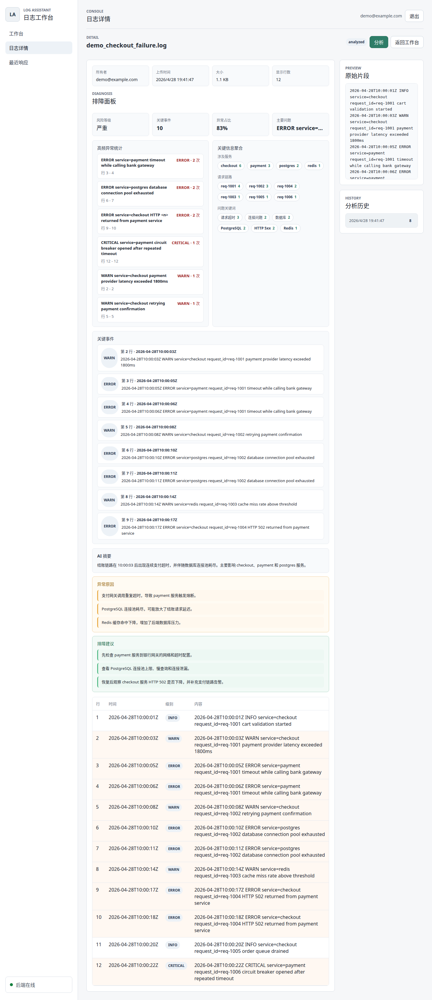

# Log Assistant

Log Assistant 是一个面向日志排障场景的智能分析平台。项目已经完成从账号体系、日志上传、日志解析、筛选检索，到异步 AI 分析和可视化排障面板的完整主链路。

当前版本适合用于课程项目、面试展示和后续功能扩展：代码结构清晰，功能边界明确，能够通过 Docker Compose 一条命令启动前端、后端、后台 Worker、PostgreSQL 和 Redis。

## 项目亮点

- **业务链路完整**：注册/登录 → 上传日志 → 解析日志 → 查看详情 → 异步分析 → 查看排障结果。
- **账号数据隔离**：日志按用户隔离，每个用户只能访问自己的日志和分析记录。
- **真实后端能力**：不是纯前端 demo，日志文件会保存到磁盘，元数据和解析结果会进入 PostgreSQL。
- **结构化解析结果**：日志行会解析出时间、级别、服务/模块名和内容，便于检索与统计。
- **异步分析流程**：分析任务提交后进入 Redis 队列，由独立 Worker 消费执行，前端轮询展示排队、分析中、完成、失败等状态。
- **AI 排障结果**：通过 DeepSeek API 生成摘要、异常原因和排障建议，并保存历史分析记录。
- **展示型排障面板**：前端聚合高频异常、关键服务、请求链路、问题关键词和关键事件时间线，适合演示。
- **一键本地部署**：Docker Compose 同时启动 API、Worker、前端、PostgreSQL、Redis，开发环境支持热更新。
- **可复现演示数据**：提供 demo 数据脚本和截图，方便快速展示项目效果。

## 界面预览



## 已完成功能

### 认证与权限

- 用户注册
- 用户登录
- 密码 PBKDF2-SHA256 加盐哈希
- JWT 鉴权
- HttpOnly Cookie 保存登录态，刷新页面后可自动恢复会话
- 日志数据按账号隔离
- 其他用户访问日志详情或分析结果时返回 404

### 日志管理

- 单文件上传
- 批量上传
- 拖拽上传
- 文件保存到 `assets/uploads/`
- 数据库存储文件名、大小、状态、上传时间、所属用户
- 用户级日志编号：每个用户的日志从 `#1` 独立递增

### 日志解析与检索

- 提取时间戳
- 提取日志级别
- 提取服务/模块名：支持 `service=xxx`、`module=xxx`、`component=xxx`、`logger=xxx`、`app=xxx` 和 `[service]`
- 提取日志内容
- 识别 `ERROR`、`WARN`、`FATAL`、`CRITICAL` 等关键事件
- 日志列表支持按关键词、状态、时间范围筛选
- 日志详情展示原始片段、解析行、ERROR/WARN 统计

### AI 分析

- `POST /logs/{id}/analyze` 提交真实分析任务
- Redis 保存任务状态：`pending`、`running`、`completed`、`failed`
- 独立 Worker 消费 Redis 队列并执行 AI 分析，避免 API 请求被长任务阻塞
- 分析完成后写入 `analysis_records`
- 前端实时轮询任务状态并刷新结果
- 支持查看历史分析记录

### 排障面板

- 高频异常统计
- 关键信息聚合：基于后端结构化的服务/模块字段、请求 ID 和问题关键词
- 关键事件时间线
- AI 摘要
- 异常原因
- 排障建议
- 分析历史回看

## 技术栈

| 层级 | 技术 |
|------|------|
| 后端 | Python 3.11, FastAPI |
| 数据库 | PostgreSQL |
| 队列/状态 | Redis |
| 前端 | Vue 3, Vite |
| AI 分析 | DeepSeek API, OpenAI SDK |
| 测试 | pytest |
| 数据库迁移 | Alembic |
| 部署 | Docker Compose |

## 快速开始

### 1. 配置环境变量

复制示例文件：

```bash
cp .env.example .env
```

编辑 `.env`，填入 DeepSeek API Key。默认模型使用 `deepseek-v4-flash`：

```bash
DEEPSEEK_API_KEY=your-deepseek-api-key
DEEPSEEK_MODEL=deepseek-v4-flash
```

不配置 API Key 时，注册、登录、上传、解析、列表、筛选、demo 数据仍可使用；AI 在线分析会不可用。

### 2. 启动服务

```bash
docker compose up --build
```

启动后访问：

- 前端页面：`http://localhost:5173`
- API 地址：`http://localhost:8000`
- 接口文档：`http://localhost:8000/docs`

### 3. 使用流程

1. 注册账号并登录
2. 上传 `.log` 或 `.txt` 日志文件
3. 在日志列表中筛选和选择日志
4. 进入日志详情页查看解析结果
5. 点击「分析」提交异步分析任务
6. 等待任务完成后查看排障面板、AI 摘要、异常原因和排障建议
7. 在分析历史中查看过往结果

## 演示数据

项目提供固定 demo 数据，适合课堂展示、面试讲解和截图复现。

先启动 Docker 服务，然后执行：

```bash
docker compose exec api python tools/demo_data/seed_demo_data.py
```

执行后使用以下账号登录：

- 邮箱：`demo@example.com`
- 密码：`demo12345`

脚本会重置这个 demo 账号，并写入一份已分析的结账链路故障日志。登录后进入日志详情页，可以直接查看排障面板、分析历史和原始日志片段。

## 生成测试日志

```bash
# 默认生成 5 个文件，每个 120 行
python tools/log_generator/generate_logs.py

# 自定义数量和行数
python tools/log_generator/generate_logs.py --files 10 --lines 300 --output sample_logs
```

生成的日志包含时间戳、级别、服务名、请求 ID 等字段，可直接上传测试。

## 本地开发

后端：

```bash
python -m venv .venv
source .venv/bin/activate
pip install -r requirements.txt
uvicorn app.main:app --reload
pytest
```

前端：

```bash
cd frontend
npm install
npm run dev
```

Docker 开发模式已挂载源码并开启热更新：

- 后端：uvicorn `--reload` 检测 `app/` 下文件变动并重启
- Worker：`python -m app.worker` 独立消费 Redis 分析队列
- 前端：Vite HMR 热更新 `frontend/src/` 下组件
- 数据库：API 容器启动前自动执行 `alembic upgrade head`
- 工具脚本：`tools/` 已挂载到 API 容器，demo 数据脚本可直接执行

## 数据库迁移

项目使用 Alembic 管理 PostgreSQL 表结构。

Docker 启动时会自动执行：

```bash
alembic upgrade head
```

本地开发也可以手动执行：

```bash
alembic upgrade head
```

如果你的本地数据库是在引入 Alembic 之前创建的，表结构已经存在但没有迁移版本记录，可以先标记当前版本：

```bash
alembic stamp head
```

之后再使用 `alembic upgrade head` 管理后续结构变更。

## 项目结构

```text
app/
  api/routes/       路由：auth, health, logs
  core/             配置、数据库、安全
  models/           数据模型
  schemas/          请求/响应 schema
  services/         业务逻辑：认证、日志、AI 分析、任务状态
  worker.py         独立后台 Worker，消费 Redis 分析任务
frontend/
  src/              Vue 3 + Vite 前端
tests/              后端自动化测试
tools/
  demo_data/        演示数据脚本
  log_generator/    测试日志生成器
docs/
  images/           README 展示截图
```

## API 列表

| 方法 | 路径 | 说明 |
|------|------|------|
| `GET` | `/health` | 健康检查 |
| `POST` | `/auth/register` | 注册 |
| `POST` | `/auth/login` | 登录 |
| `POST` | `/logs/upload` | 上传单个日志 |
| `POST` | `/logs/upload/batch` | 批量上传日志 |
| `GET` | `/logs` | 日志列表，支持 `keyword`、`status`、`start_time`、`end_time` |
| `GET` | `/logs/{id}` | 日志详情 |
| `POST` | `/logs/{id}/analyze` | 提交 AI 分析任务 |
| `GET` | `/logs/{id}/analyze/status` | 查询分析任务进度和结果 |
| `GET` | `/logs/{id}/analyses` | 查看分析历史记录 |

## 当前完成度

| 里程碑 | 状态 | 说明 |
|--------|------|------|
| 日志上传与解析 | 已完成 | 文件保存、数据库记录、解析时间戳/级别/服务模块/内容 |
| 日志列表与详情 | 已完成 | 支持账号隔离、列表筛选、详情查看 |
| 真实注册登录 | 已完成 | 用户表、重复邮箱检查、密码哈希、JWT、Cookie 会话恢复 |
| AI 分析 | 已完成 | 摘要、异常原因、排障建议、历史记录 |
| 异步分析 | 已完成 | Redis 队列、独立 Worker、任务状态、前端轮询 |
| 展示型结果页 | 已完成 | 高频异常、关键信息聚合、关键事件、截图 |
| 数据库迁移 | 已完成 | Alembic 管理表结构，Docker 启动自动迁移 |

## 待完善方向

- 增加 refresh token 机制，进一步拉长会话有效期并支持主动续期。
- 为前端补充自动化测试。
- 日志查询继续增强分页、高亮命中、复杂组合筛选。
- 分析面板继续增加趋势图、服务维度聚合和告警规则。

## 验证

当前版本已通过：

```bash
pytest -q
cd frontend
npm run build
```

## 备注

- `app/core/config.py` 集中管理基于环境变量的配置。
- PostgreSQL 存储用户、日志元数据、解析结果和分析记录。
- Redis 用于异步分析任务队列和状态管理，任务状态默认保留 24 小时。
- 上传文件保存在 `assets/uploads/`，Docker Compose 中使用 volume 持久化。
- AI 分析通过 DeepSeek API 实现，使用 OpenAI SDK 调用。
